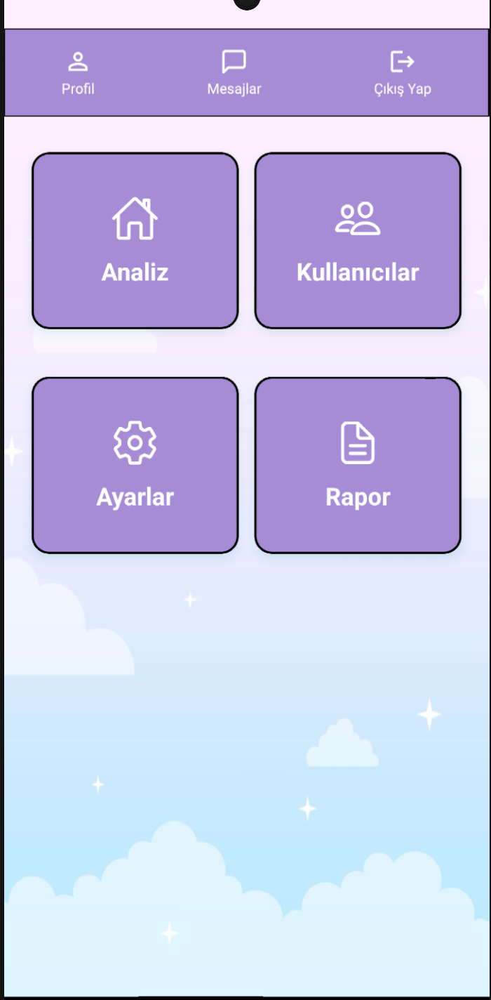
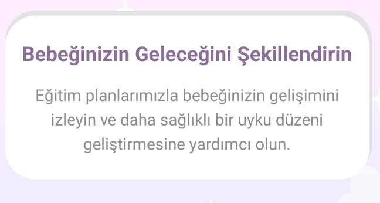
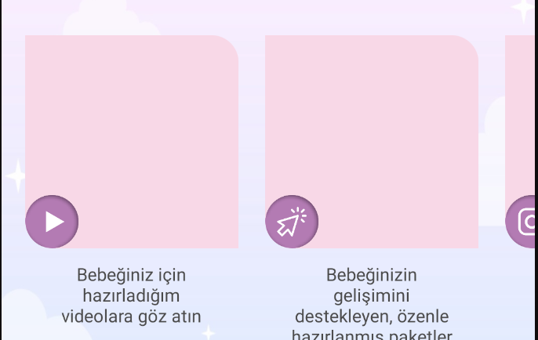
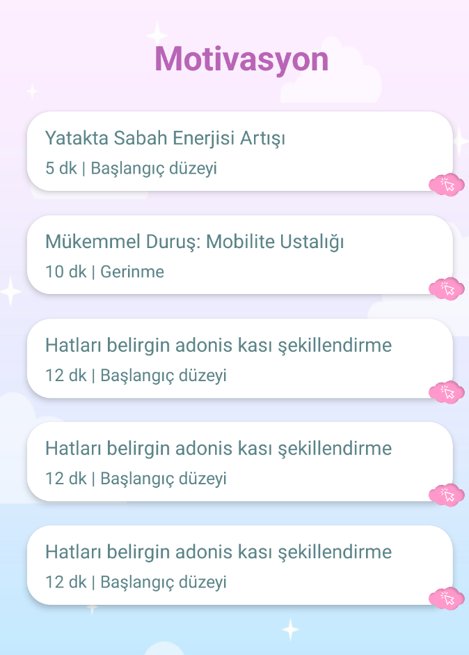
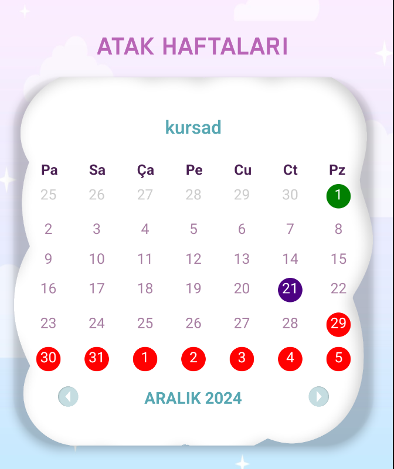

# kullanılan paketler 

"dependencies": {
    "@notifee/react-native": "^9.1.3",
    "@react-native-async-storage/async-storage": "^2.1.0",
    "@react-native-community/cli": "^15.1.2",
    "@react-native-community/datetimepicker": "^8.2.0",
    "@react-native-firebase/app": "^21.6.1",
    "@react-native-firebase/auth": "^21.6.1",
    "@react-native-firebase/firestore": "^21.6.1",
    "@react-native-firebase/messaging": "^21.6.1",
    "@react-native-picker/picker": "^2.10.2",
    "@react-navigation/bottom-tabs": "^7.0.12",
    "@react-navigation/native": "^7.0.7",
    "@react-navigation/native-stack": "^7.1.8",
    "axios": "^1.7.8",
    "moment": "^2.30.1",
    "react": "18.3.1",
    "react-native": "^0.76.5",
    "react-native-calendars": "^1.1286.0",
    "react-native-gesture-handler": "^2.21.2",
    "react-native-get-random-values": "^1.11.0",
    "react-native-linear-gradient": "^2.8.3",
    "react-native-modal-datetime-picker": "^18.0.0",
    "react-native-pdf": "^6.7.5",
    "react-native-reanimated": "^3.16.5",
    "react-native-safe-area-context": "^5.0.0",
    "react-native-screens": "^4.3.0",
    "react-native-svg": "^15.10.1",
    "react-native-uuid": "^2.0.3",
    "react-native-vector-icons": "^10.2.0",
    "react-native-video": "^6.8.2",
    "react-native-webview": "^13.12.4"
},

# ** Bu bilgilendirme Component kısmında başlayıp sırası ile aşağıya doğru iner. Alfabetik olarak bütün dosyaları içeriğini anlatır ** 

<!-- Admin sayfası görseli -->


## podfile'a notifee için gerekli target eklendi. ios tarafında sadece developer hesabı açılınca bildirim için sertifika eklenecek

### - #Components

#### Admin navbar  
- profile kısmı boş admin için özelleştirecek bir kısım yok isteğe göre kaldırılabilir 
- admin mesajlaşma kısmı şuan aktif olarak çalışıyor kullanıcıların sıralandığı ve en son mesaj atanın gösterildiği kısım mevcut 
- çıkış yap kısmı kullanıcın token'ını unutması için kaydediyoruz ve hızlı giriş yapıyoruz 

#### Card 
- admin kısmında yönlendirmelerin tasarımını içeriyor, sade tutuldu 

#### CustomBackGround

- bu kısım kullanıcının HomeScreen ekranında bulunan bilgilendirme yazısı


  
#### CustomDropdown 
- bu kısımda flatlist kullanıldı, bizim oluşturduğumuz Component kullanılmadı içerisinde kendi tasarımı mevcut 

<!-- Örnek DropDown (yerel görsel henüz tanımlı değilse alt="" yapabilirsiniz) -->


<!-- Burada external (örnek) bir resim kullanılıyor ise: 

-->

#### HomeProfil
- home kısmında bulunan profil, merhaba yazısı ve kullanıcı profil kısmında kullanılan profil iconunu içerir 

#### MyButton 
- uygulama ekranında açılan ilk kısım ve giriş yap / kayıt ol
- aynı zamanda kullanıcı kısmında bulunan SSS & destek ve profil butonlarında bulunur 

#### MyFlatlist

##### FlatlistRenderItem Dizini

- **AdminExerciseItem**: Aslında admin tarafında planları otomatik değiştirmek için kullanılacaktı ama kaldırıldı 
- **CatalogItem**: Bu bilgilendirme yazısından sonra altta kullanılan youtube, bütün planlar ve instagram yönlendirme için yapılan kısmı içerir
- **ExerciseItem**: İsim yanıltmasın, normalde bu kısım Planların olduğu kullanıcı kısmının HomeScreen'inin en altında bulunan Flatlist öğesi ve bütün planları içerir
- **Memnuniyet**: Bu kısım ExerciseItem'ın hemen üstünde bulunan, sadece görselleri sıralamak için
- **VideoItem**: Youtube videolarının gösterileceği kısım. Bu kısımlar özellikle youtube tarafından çekilmedi, linkleri MyFlatlist kısmında tutuluyor, diğer kısımlarda statik olarak tasarlandı 

- #Eklenmesi gereken kısım: premium içerik videolarının olduğu kısım eklenecek. O da FirebaseStorageden çekilebilir.
    
<!-- Planlar.png -->


<!-- CatalogItem.png -->


<!-- memnuniyet.png -->


<!-- Motivasyon.png -->


### MyNavbar
- bu kısım aslında BottomBar olacak ama ismi değiştirilmedi; bu kısımda sırasıyla ayarlar, bildirim, home, mesaj ve profil kısımları bulunmakta

### MyTextInput
- bu kısımlar Register ve Login Kısmında kullanıldı, başka bir yerde kullanılmadı

### SubsCriptionCalender
- Bu kısımda kişinin çocuğunun Atak Haftaları için işlem yapılır ve bu kısım HomeScreen de gösterilir. İçerik olarak:
    - 48. hafta
    - 44. hafta
    - 40-41. haftalar
    - 14-17. haftalar (4. Ay)
    - 36.hafta
    - 8.ay (33-36 haftalar)
    - 29.hafta
    - 26.hafta
    - 11. hafta
    - 7. hafta
    - 4.-5. hafta (ilk farkındalık atağı)
    - Doğum günü kontrolü
    - ve diğer normal günler bulunur. Bu el ile tasarlanmış olup sadece tıklandığı kısmın ne içeriyorsa onun içeriğini gönderir. Bu haftaların başlangıç tarihi kullanıcı profilden çocuğun doğum tarihi bilgilerini giriş yaparsa FireStore'a eklenir ve bu haftalarda bildirim gönderilir (şu an push notifications ayarlanmadı)


  
### YoutubeVideo
- bu kısımda VideoItem bileşeninde kullanılır. Aslında VideoItem'a tıklanınca açılan modalda kullanılır.

---

## - #Context

### BackGround context
- Arka planda kullanılan resimleri içerir

### ColorsContext 
- Genel olarak kullanılan renk paketlerini içerir

### FontsContext
- Genelde kullanılan fontları içerir

### PaymentFlag
- Bu kısım kullanıcı ödeme yaptıktan sonra HomeScreende Users Koleksiyonunun tekrar çağrılmasına yarar

### SubsCriptionContext
- Bütün Aylık Paketleri Firebaseden alır ama şu an kaldırıldı, hiçbir yerde kullanılmıyor. Paketler statik olarak eklendi.

### UserContext
- Kullanıcı bilgilerini çekip saklamak için bu kısım HomeScreende ya da login Screende çağrılıyor  

### userToken 
- Bu kısımda HomeScrende çağrılır ve kullanıcı token'ı tutulur.


## - #Screen


# AdminChatScreen
!!! mesaj bildirimi için fonksiyon eklenmiştir !!!

`AdminChatScreen`, bir admin ile belirli bir kullanıcı arasında sohbet yönetimi için tasarlanmış bir React Native bileşenidir. Gerçek zamanlı mesajlaşma için Firebase Firestore ile entegredir.

## Özellikler

- Gerçek zamanlı olarak sohbet mesajlarını görüntüler.
- Admin olarak belirli bir kullanıcıya mesaj gönderme.
- Mesaj geçmişini alma ve görüntüleme.
- Kullanıcı dostu, şık bir sohbet arayüzü.
- Klavyeye duyarlı tasarım ile sorunsuz giriş deneyimi.

---

## Kurulum

1. Firebase entegrasyonu yapılmış bir React Native projeniz olduğundan emin olun.
2. Projenize `@react-native-firebase/firestore` paketini ekleyin:
   ```bash
   npm install @react-native-firebase/firestore


# AdminConversationsScreen

`AdminConversationsScreen`, admin kullanıcıların tüm mevcut sohbetleri listelemesini ve kullanıcılarla bireysel sohbet başlatmasını sağlayan bir React Native bileşenidir. Firebase Firestore ile gerçek zamanlı veri senkronizasyonu sağlar.

## Özellikler

- Tüm mevcut sohbetleri sıralı şekilde listeleme.
- Her sohbet için kullanıcı adını, kullanıcı ID'sini ve son mesajı gösterir.
- Bir kullanıcıya tıklanarak bireysel sohbete geçiş yapılabilir.
- Gerçek zamanlı veri güncellemeleri ile sohbet listesi dinamik olarak yenilenir. (aktif abonelik planlarına göre gruplandırılır)

---

## Kurulum

1. Firebase entegrasyonu yapılmış bir React Native projeniz olduğundan emin olun.
2. Projenize `@react-native-firebase/firestore` paketini ekleyin:
   ```bash
   npm install @react-native-firebase/firestore


# AdminHomeScreen

## Genel Bakış

`AdminHomeScreen`, uygulamanın yönetici kullanıcıları için tasarlanmış bir ekran bileşenidir. Bu bileşen, yönetici kullanıcıların analizlere, kullanıcı yönetimine, ayarlara ve raporlara hızlı erişim sağlayan etkileşimli kartlar aracılığıyla navigasyon yapmalarını sağlar. Firestore ile entegre olarak, kullanıcı verilerini dinamik olarak çeker ve günceller.

## Özellikler

- **Kullanıcı Yönetimi:** Firestore'dan kullanıcı verilerini çeker ve yönetir. Yönetici kullanıcıyı hariç tutarak diğer kullanıcıların abonelik bilgilerini görüntüler.
- **Navigasyon Kartları:** Analiz, Kullanıcılar, Ayarlar ve Raporlar gibi farklı bölümlere hızlı erişim sağlayan interaktif kartlar sunar.
- **Responsive Tasarım:** Farklı cihaz boyutlarına uyum sağlayan esnek tasarım kullanır.
- **Arka Plan Özelleştirmesi:** `BackgroundContext` aracılığıyla arka plan resimlerini özelleştirir.
- **Hata Yönetimi:** Kullanıcı verisi çekme ve diğer işlemler sırasında oluşabilecek hataları kullanıcıya bildirir.

## Bağımlılıklar

- **React & React Native:** Bileşenin temelini oluşturur.
- **@react-native-firebase/auth:** Kullanıcı kimlik doğrulaması için kullanılır.
- **@react-native-firebase/firestore:** Firestore ile veri alışverişi sağlar.
- **Context API:** Arka plan resimleri için `BackgroundContext` kullanılır.
- **React Navigation:** Ekranlar arasında navigasyonu yönetir.

## Kurulum

### 1. Gerekli Bağımlılıkların Yüklenmesi

Projeye gerekli Firebase ve diğer bağımlılıkları eklemek için aşağıdaki komutları çalıştırın:

```bash
npm install @react-native-firebase/app @react-native-firebase/auth @react-native-firebase/firestore
npm install react-navigation

useEffect(() => {
  const fetchUsers = async () => {
    try {
      const currentUser = auth().currentUser;
      if (!currentUser) {
        Alert.alert('Hata', 'Giriş yapmış kullanıcı bulunamadı.');
        return;
      }

      const usersCollectionRef = firestore().collection('users');
      const usersSnapshot = await usersCollectionRef.get();

      if (usersSnapshot.empty) {
        Alert.alert('Hata', 'Hiç kullanıcı bulunamadı.');
        return;
      }

      const userList = usersSnapshot.docs
        .map((doc) => {
          const userData = doc.data();
          const userId = doc.id;

          // Admin'i hariç tut
          if (userId === currentUser.uid) { return null; }

          return {
            id: userId,
            ...userData, // Kullanıcı bilgileri ve abonelikler doğrudan burada
          };
        })
        .filter(Boolean); // Geçerli kullanıcıları filtrele

      if (userList.length === 0) {
        Alert.alert('Hata', 'Kullanıcı verisi bulunamadı.');
      } else {
        setUsersWithSubscriptions(userList);
      }
    } catch (error) {
      console.error('Kullanıcılar alınırken hata oluştu:', error);
      Alert.alert('Hata', 'Kullanıcı verileri alınırken bir sorun oluştu.');
    }
  };

  fetchUsers();
}, []);
```

# ChatScreen

## Genel Bakış

`ChatScreen` bileşeni, kullanıcıların sohbet mesajlarını görüntüleyebileceği ve gönderebileceği bir ekran sunar. Firestore ile entegre olarak çalışan bu bileşen, gerçek zamanlı olarak mesajları günceller ve mesaj gönderme işlevselliği sağlar.

## Özellikler

- **Gerçek Zamanlı Mesajlaşma:** Firestore'un `onSnapshot` özelliğini kullanarak gerçek zamanlı mesaj güncellemeleri.
- **Mesaj Gönderimi:** Kullanıcıların mesaj göndermesine olanak tanır ve bu mesajları Firestore'a kaydeder.
- **Mesajların Ayrımı:** Kullanıcı ve yönetici mesajlarını farklı renklerle ayırarak görsel bir hiyerarşi sağlar.
- **Klavye Uyumluluğu:** `KeyboardAvoidingView` kullanılarak klavye giriş alanını kapatmaz.

## Bağımlılıklar

- **React & React Native:** Bileşenin temelini oluşturur.
- **@react-native-firebase/auth:** Kullanıcı kimlik doğrulaması için kullanılır.
- **@react-native-firebase/firestore:** Firestore ile veri alışverişi sağlar.
- **Context API:** `BackgroundContext` ve `FontsContext` kullanılarak arka plan resmi ve yazı tipleri özelleştirilir.

## Kurulum

### 1. Gerekli Bağımlılıkların Yüklenmesi

Projeye gerekli Firebase ve diğer bağımlılıkları eklemek için aşağıdaki komutları çalıştırın:

useEffect Hook: Bileşen yüklendiğinde Firestore'dan kullanıcı verilerini çeker ve 'usersWithSubscriptions' state'ini günceller.
```bash
npm install @react-native-firebase/app @react-native-firebase/auth @react-native-firebase/firestore
useEffect(() => {
  const currentUser = auth().currentUser;
  if (!currentUser) return;

  const userId = currentUser.uid;
  const conversationId = userId;

  const unsubscribe = firestore()
    .collection('conversations')
    .doc(conversationId)
    .collection('messages')
    .orderBy('timestamp', 'desc')
    .onSnapshot((querySnapshot) => {
      const messagesData = [];
      querySnapshot.forEach((doc) => {
        messagesData.push({
          id: doc.id,
          ...doc.data(),
        });
      });
      setMessages(messagesData);
    });

  return () => unsubscribe();
}, []);


const sendMessage = async () => {
  const currentUser = auth().currentUser;
  if (!currentUser) return;

  const userId = currentUser.uid;
  const conversationId = userId;

  if (messageText.trim() === '') return;

  const messageData = {
    senderId: userId,
    receiverId: 'admin',
    text: messageText.trim(),
    timestamp: firestore.FieldValue.serverTimestamp(),
  };

  try {
    await firestore()
      .collection('conversations')
      .doc(conversationId)
      .collection('messages')
      .add(messageData);

    await firestore()
      .collection('conversations')
      .doc(conversationId)
      .set(
        {
          participants: [userId, 'admin'],
          lastMessage: messageData,
        },
        { merge: true }
      );

    setMessageText('');
  } catch (error) {
    console.error('Mesaj gönderilirken hata oluştu:', error);
  }
};

```


# DashBoard

## Genel Bakış

`DashBoard` bileşeni, uygulamanın abonelik raporlarını yöneticilere sunmak için tasarlanmıştır. Firestore'dan kullanıcı verilerini çeker, abonelik bilgilerini analiz eder ve toplam abonelik sayısı, ücretsiz kullanıcılar ve paketlere göre kullanıcı dağılımı gibi önemli metrikleri görsel bir şekilde gösterir.

## Özellikler

- **Gerçek Zamanlı Veri Çekme:** Firestore'dan dinamik olarak kullanıcı verilerini çeker.
- **Abonelik Analizi:** Şu metrikleri hesaplar:
  - Toplam abonelik sayısı.
  - Abonelik alan kullanıcı sayısı.
  - Ücretsiz kullanıcı sayısı.
  - Birden fazla abonelik alan kullanıcı sayısı.
  - Paket bazında kullanıcı sayıları.
- **Responsive Tasarım:** Farklı cihaz boyutlarına uygun bir tasarım.
- **Yükleme Durumu:** Veri alınırken bir yükleme göstergesi görüntüler.

## Bağımlılıklar

- **React & React Native:** Bileşenin temel framework'ü.
- **@react-native-firebase/firestore:** Firestore'dan veri çekmek ve yönetmek için kullanılır.
- **react-native-vector-icons/MaterialIcons:** Görsel ikonları kullanmak için.

## Kurulum

### Ön Gereksinimler

Gerekli bağımlılıkları yüklemek için aşağıdaki komutları çalıştırın:

 bu kısımda raporu uygulama içinde yapıyoruz kullanıclar firestore da filtreleme yapabilir 

```bash
npm install @react-native-firebase/app @react-native-firebase/firestore react-native-vector-icons

useEffect(() => {
  const generateReport = async () => {
    try {
      const usersCollectionRef = firestore().collection('users');
      const usersSnapshot = await usersCollectionRef.get();

      if (usersSnapshot.empty) {
        console.error('Hiç kullanıcı bulunamadı.');
        setLoading(false);
        return;
      }

      const users = usersSnapshot.docs.map((doc) => ({
        id: doc.id,
        ...doc.data(),
      }));

      let totalSubscriptions = 0;
      let freeUsersCount = 0;
      let usersWithMultipleSubscriptions = 0;
      const packageCounts = {};
      const uniqueUsersWithSubscriptions = new Set();

      users.forEach((user) => {
        const { subscriptions } = user;

        if (subscriptions && subscriptions.length > 0) {
          totalSubscriptions += subscriptions.length;
          uniqueUsersWithSubscriptions.add(user.id);

          subscriptions.forEach((subscription) => {
            const packageName = subscription.packet_name;
            packageCounts[packageName] = (packageCounts[packageName] || 0) + 1;
          });

          if (subscriptions.length > 1) {
            usersWithMultipleSubscriptions += 1;
          }
        } else {
          freeUsersCount += 1;
        }
      });

      const reportData = {
        totalSubscriptions,
        freeUsersCount,
        usersWithMultipleSubscriptions,
        uniqueUsersWithSubscriptionsCount: uniqueUsersWithSubscriptions.size,
        packageCounts,
      };

      setReport(reportData);
    } catch (error) {
      console.error('Rapor oluşturulurken hata:', error);
    } finally {
      setLoading(false);
    }
  };

  generateReport();
}, []);
```

# Destek Ekranı
 !!! bu kısımı sadece görüntü amaçlı eklendi fonksiyonel olarak bir şey çalışmıyor !!!
## Genel Bakış

`Destek` bileşeni, kullanıcıların uygulama ayarlarını değiştirmesine, sorun bildirmesine ve yasal bilgilere erişmesine olanak tanır. Şık bir tasarıma sahip olan bu bileşen, kullanıcı deneyimini artırmak için çeşitli özelleştirme seçenekleri ve eylem butonları içerir.

## Özellikler

- **Uygulama Tercihleri:** 
  - Dil seçimi
  - Ölçü birimi
  - Bildirimler
- **Sorun Giderme:** 
  - Uygulama bilgileri
  - Sorun bildirimi
- **Yasal Bilgilendirme:**
  - Şartlar ve koşullar
  - Gizlilik politikası
- **Kullanıcı Eylemleri:**
  - Verileri sıfırla
  - Çıkış yap
  - Hesabı sil

## Bağımlılıklar

- **React & React Native:** Temel framework.
- **Context API:** Arka plan, yazı tipleri ve renk temaları için `FontsContext`, `BackgroundContext`, ve `ColorsContext` kullanılır.

## Kullanım

`Destek` bileşenini uygulamanıza aşağıdaki şekilde dahil edebilirsiniz:


# ForgotPasswordScreen

## Genel Bakış

`ForgotPasswordScreen`, kullanıcıların şifrelerini sıfırlamaları için bir e-posta adresi girmelerini sağlayan bir ekran sunar. Firebase Authentication ile entegre olarak, kullanıcılara şifre sıfırlama bağlantısını e-posta ile gönderir. Şık ve kullanıcı dostu bir tasarıma sahiptir.

## Özellikler

- **E-posta Girişi:** Kullanıcıların şifre sıfırlama işlemi için e-posta adresi girmelerini sağlar.
- **Şifre Sıfırlama:** Firebase Authentication aracılığıyla şifre sıfırlama bağlantısı gönderir.
- **Hata Yönetimi:** Eksik veya geçersiz e-posta durumlarında kullanıcıyı bilgilendirir.
- **Dinamik Stil:** Yazı tipi, renk ve arka plan `Context API` üzerinden dinamik olarak değiştirilebilir.

## Bağımlılıklar

- **React & React Native:** Temel framework.
- **@react-native-firebase/auth:** Firebase Authentication işlemleri için.
- **Context API:** Renkler, yazı tipleri ve arka planlar için `ColorsContext`, `FontsContext`, ve `BackgroundContext` kullanılır.

## Kullanım

`ForgotPasswordScreen` bileşenini uygulamanıza dahil etmek için aşağıdaki kodu kullanabilirsiniz:


```bash
const handlePasswordReset = async () => {
  if (!email) {
    Alert.alert('Hata', 'Lütfen bir e-posta adresi girin.');
    return;
  }
  try {
    await sendPasswordResetEmail(auth, email);
    Alert.alert(
      'Başarılı',
      'Şifre sıfırlama bağlantısı e-postanıza gönderildi.'
    );
    navigation.goBack();
  } catch (error) {
    Alert.alert('Hata', error.message);
  }
};
```

# HomeScreen

## Genel Bakış

`HomeScreen` bileşeni, uygulamanın ana sayfası olarak işlev görür. Kullanıcı bilgilerini, abonelik durumunu, motivasyon içeriklerini ve planları görüntüler. Dinamik saat ve tarih bilgisi içerir ve kullanıcı profili ile çeşitli içerik bileşenlerine kolay erişim sağlar.

## Özellikler

- **Kullanıcı Bilgileri:** Kullanıcı profili ve abonelik bilgilerini çeker ve gösterir.
- **Dinamik Zaman Güncellemeleri:** Saat, tarih ve ay bilgileri gerçek zamanlı olarak güncellenir.
- **Abonelik Takvimi:** Kullanıcı abonelik takvimi ile atak haftaları gösterilir.
- **Motivasyon İçerikleri:** Kullanıcılara özel motivasyon ve plan içeriklerini listeler.
- **Dinamik Navigasyon:** Farklı içeriklere yönlendirme sağlar.

## Bağımlılıklar

- **React & React Native:** Uygulamanın temel framework'ü.
- **@react-native-firebase/auth & firestore:** Kullanıcı kimlik doğrulama ve veri yönetimi.
- **Context API:** Renkler, yazı tipleri, arka planlar ve kullanıcı bilgileri için kullanılır.
- **react-native-vector-icons:** İkonları kullanmak için.

## Kullanım

State yönetimi:

currentMONTH, currentDayNumber, currentYear: Dinamik tarih bilgilerini saklar.
currentHour, currentMinute: Gerçek zamanlı saat bilgilerini saklar.
menuVisible, logoutModalVisible: Menü ve modal görünürlüğünü yönetir.
flag: Kullanıcı verilerinin yenilenmesi gerektiğini belirler.
Context Kullanımı
FontsContext: Yazı tipi bilgilerini sağlar.
BackgroundContext: Arka plan görüntüsünü sağlar.
ColorsContext: Renk temalarını sağlar.
UserContext: Kullanıcı bilgilerini ve abonelik durumunu günceller.
PaymentFlagContext: Ödeme durumu ile ilgili flag bilgisini yönetir.


```bash
// Kullanıcı Verilerinin Çekilmesi
const fetchUserData = async () => {
  try {
    const currentUser = auth().currentUser;
    if (currentUser) {
      const userDocRef = firestore().collection('users').doc(currentUser.uid);
      const userDoc = await userDocRef.get();
      if (userDoc.exists) {
        const userData = userDoc.data();
        updateUser({ ...userData });
        setFlag(false);
      }
    }
  } catch (error) {
    console.error('Error fetching user data:', error);
  }
};


// Saat ve Tarih Bilgisi
useEffect(() => {
  const updateTime = () => {
    const date = new Date();
    setCurrentMONTH(date.toLocaleDateString('tr-TR', { weekday: 'long' }));
    setCurrentDayNumber(date.toLocaleDateString('tr-TR', { month: 'long' }));
    setCurrentYear(date.toLocaleDateString('tr-TR', { year: 'numeric' }));

    const hours = date.getHours().toString().padStart(2, '0');
    const minutes = date.getMinutes().toString().padStart(2, '0');
    setCurrentHour(hours);
    setCurrentMinute(minutes);
  };

  updateTime();
  const intervalId = setInterval(updateTime, 60000);
  return () => clearInterval(intervalId);
}, []);
```

# LoginScreen

## Genel Bakış

`LoginScreen`, kullanıcıların e-posta ve şifre bilgileriyle giriş yapmasını sağlayan, Firebase Authentication ile entegre bir bileşendir. Kullanıcı giriş bilgilerini doğruladıktan sonra, Firestore'dan kullanıcı bilgilerini çeker ve yönlendirme yapar. Aynı zamanda admin kullanıcıları için özel bir yönlendirme sağlar.

## Özellikler

- **Kullanıcı Girişi:** Firebase Authentication kullanarak e-posta ve şifre doğrulama.
- **Otomatik Giriş:** Kullanıcı oturumu açıkken otomatik giriş kontrolü.
- **Kullanıcı Verisi Çekme:** Firestore'dan kullanıcı bilgilerini ve abonelik durumunu alır.
- **Admin ve Normal Kullanıcı Ayrımı:** Kullanıcı türüne göre yönlendirme yapar.
- **Hata Yönetimi:** Hataları kullanıcıya gösteren bir modal bileşeni ile birlikte gelir.

## Bağımlılıklar

- **React & React Native:** Uygulamanın temel framework'ü.
- **@react-native-firebase/auth & firestore:** Firebase kimlik doğrulama ve veri yönetimi.
- **AsyncStorage:** Kullanıcı oturum bilgilerini yerel olarak saklama (opsiyonel).
- **Context API:** Renkler, yazı tipleri, kullanıcı ve abonelik bilgileri için `Context` kullanılır.

## Kullanım

```bash
const fetchUserData = async () => {
  try {
    const currentUser = auth().currentUser;
    if (currentUser) {
      const userDocRef = firestore().collection('users').doc(currentUser.uid);
      const userDoc = await userDocRef.get();

      if (userDoc.exists) {
        const userData = userDoc.data();
        updateUser({ ...userData });
        setFlag(false);
      } else {
        setModalContent('Kullanıcı verileri bulunamadı.');
        setInfoModalVisible(true);
      }
    }
  } catch (error) {
    setModalContent('Kullanıcı verilerini çekerken bir hata oluştu.');
    setInfoModalVisible(true);
  }
};
```


# OnboardingScreen

## Genel Bakış

`OnboardingScreen`, uygulamaya ilk kez giriş yapan kullanıcılar için tasarlanmış bir karşılama ekranıdır. Kullanıcıyı hoş bir görsel ile karşılar ve tek bir "Devam" butonu sunarak giriş ekranına yönlendirir.

## Özellikler

- **Karşılama Görseli:** Ekranı tamamen kaplayan bir arka plan görseli sunar.
- **Devam Butonu:** Kullanıcıyı `LoginScreen` ekranına yönlendirir.
- **Minimalist Tasarım:** Basit ve kullanımı kolay bir arayüz sağlar.

## Bağımlılıklar

- **React & React Native:** Uygulamanın temel framework'ü.
- **react-native-vector-icons:** İkonlar için.
- **React Navigation:** Ekranlar arası geçiş için.

## Kullanım


# PackageDetails

## Genel Bakış

`PackageDetails`, kullanıcıların abonelik paketlerinin detaylarını görüntüleyip düzenleyebileceği, hatta gerekirse paketi silebileceği bir ekran sağlar. Ayrıca düzenleme modunu aktif hale getirerek paketin bilgilerini güncellemeye olanak tanır.

## Özellikler

- **Paket Detaylarını Görüntüleme:** Paket adını, açıklamasını, süresini, fiyatını ve görsel URL'sini görüntüler.
- **Paket Düzenleme:** Kullanıcı, mevcut paketi düzenleme modunda güncelleyebilir.
- **Paket Silme:** Kullanıcı, bir paketi silerek listeden kaldırabilir.
- **Geri Dön:** Kullanıcıyı bir önceki ekrana yönlendirir.

## Bağımlılıklar

- **React & React Native:** Uygulamanın temel framework'ü.
- **react-native-safe-area-context:** Cihazın güvenli alanlarıyla uyumlu düzen.
- **Context API:** `SubscriptionsContext` ile abonelik bilgileri yönetimi.

## Kullanım

# Payment

## Genel Bakış
`Payment` bileşeni, kullanıcıların satın alma sürecini başlatmadan önce bilgilendirilmesi için tasarlanmış bir ekran sunar. Bu ekranda satın alma sürecine dair başlıklar ve görsellerle detaylı bilgi sağlanır ve kullanıcıyı satın alma ekranına yönlendiren bir buton bulunur.

---

## Özellikler

- **Arkaplan ve Başlık Görselleri:** Ekrana estetik bir görünüm kazandırır.
- **Bilgilendirme Kartları:** Kullanıcılara satın alma öncesinde sağlanacak hizmetler hakkında bilgi verir.
- **Satın Al Butonu:** Kullanıcıyı ödeme işlemi ekranına yönlendirir.

---

## Kullanım

# Payment2
  !!! iyzico entegrasyonu eklenmedi !!!
## Genel Bakış
`Payment2` bileşeni, kullanıcıların abonelik satın alma işlemini tamamlamalarını sağlayan bir ekrandır. Bu ekran, abonelikle ilgili detayları görüntüler ve satın alma işlemini başlatan bir buton içerir. 

---

## Özellikler

- **Abonelik Bilgileri:** Kullanıcıya, seçilen abonelik paketine ait başlık, açıklama ve fiyat bilgisi sunar.
- **Satın Alma İşlemi:** Kullanıcı, "Abonelik Al" butonuna tıklayarak satın alma işlemini başlatabilir.
- **Firestore Entegrasyonu:** Satın alma işlemi başarıyla tamamlandığında, abonelik bilgileri Firestore'a kaydedilir.

---

## Kullanım

```bash
const handlePayment = async () => {
  try {
    const currentUser = auth().currentUser;
    const userId = currentUser.uid;

    const subscriptionData = {
      amount_paid: data.price,
      is_active: true,
      subscription_start: firestore.Timestamp.now(),
      subscription_end: firestore.Timestamp.fromDate(new Date().setDate(new Date().getDate() + 30)),
      packet_name: data.title,
      subscription_duration: data.subscription_duration,
    };

    const userRef = firestore().collection('users').doc(userId);
    await userRef.update({
      subscriptions: firestore.FieldValue.arrayUnion(subscriptionData),
    });

    Alert.alert('Başarılı', 'Abonelik alındı.');
    navigation.navigate('Home');
  } catch (error) {
    console.error('Abonelik oluşturulurken bir hata oluştu:', error);
    Alert.alert('Hata', error.message);
  }
};
```

# ProfileScreen

## Genel Bakış

`ProfileScreen`, kullanıcının ve bebeğinin bilgilerini görüntüleyip düzenleyebildiği bir ekrandır. Kullanıcı, bebeğine ait boy, kilo, doğum tarihi ve cinsiyet bilgilerini güncelleyebilir ve bu bilgileri Firestore veritabanına kaydedebilir.

---

## Özellikler

- **Kullanıcı Bilgileri Görüntüleme:** Kullanıcının adı ve e-posta adresi gibi temel bilgilerini görüntüler.
- **Bebek Bilgileri Düzenleme:** Bebek adı, boyu, kilosu, cinsiyeti ve doğum tarihi gibi bilgileri düzenleyip Firestore'a kaydeder.
- **Doğum Tarihi ve Cinsiyet Seçimi:** Kullanıcı, tarih seçici ve cinsiyet seçim modalları ile kolayca bilgi girişi yapabilir.

---

## Kullanım

Bu ekran, kullanıcının mevcut verilerini görüntülemek ve gerektiğinde güncellemelerini sağlamak için tasarlanmıştır. Bebek bilgilerini düzenledikten sonra `Kaydet` butonuna tıklayarak değişiklikleri Firestore'a kaydedebilirsiniz.

---

## Fonksiyonlar

### 1. **handleSave**

Bu fonksiyon, bebeğin bilgilerini doğrular ve Firestore'da kullanıcı verilerini günceller. 

- Eğer kullanıcı daha önce bebek bilgisi eklediyse, mevcut bilgiyi günceller.
- Eğer yeni bir bebek ekleniyorsa, Firestore'daki "children" dizisine ekleme yapılır.

```javascript
const handleSave = async () => {
  if (!child.name || !child.gender || !child.birthDate) {
    Alert.alert('Hata', 'Lütfen tüm alanları doldurun.');
    return;
  }

  const childData = {
    name: child.name,
    gender: child.gender,
    birthDate: child.birthDate ? child.birthDate.toISOString().split('T')[0] : '',
    height: child.height ? parseFloat(child.height) : null,
    weight: child.weight ? parseFloat(child.weight) : null,
  };

  try {
    if (user?.children?.length > 0) {
      await firestore()
        .collection('users')
        .doc(userid)
        .update({
          children: firestore.FieldValue.arrayRemove(initialChild),
        });
      await firestore()
        .collection('users')
        .doc(userid)
        .update({
          children: firestore.FieldValue.arrayUnion(childData),
        });
    } else {
      await firestore()
        .collection('users')
        .doc(userid)
        .update({
          children: firestore.FieldValue.arrayUnion(childData),
        });
    }
    Alert.alert('Başarılı', 'Bilgiler güncellendi.');
  } catch (error) {
    Alert.alert('Hata', 'Bilgiler kaydedilirken bir hata oluştu.');
  }
};
```

# RegisterScreen

## Genel Bakış

`RegisterScreen`, yeni kullanıcıların uygulamaya kayıt olmasını sağlayan bir ekrandır. Kullanıcı, gerekli bilgileri doldurduktan sonra Firebase Authentication ile bir hesap oluşturulur ve bilgileri Firestore veritabanına kaydedilir.

---

## Özellikler

- **Firebase Authentication ile Kullanıcı Kaydı:**
  - E-posta ve şifre doğrulaması.
  - Güçlü şifre kontrolü.
- **Firestore'a Kullanıcı Bilgisi Kaydı:**
  - Kullanıcı adı, e-posta, telefon numarası gibi bilgilerin kaydedilmesi.
- **Form Doğrulama:**
  - Şifreler arasındaki eşleşme kontrolü.
  - Eksik veya hatalı bilgi kontrolü.

---

## Kullanım

1. Kullanıcı, kayıt ekranında gerekli alanları doldurur.
2. `Register` butonuna tıklanır.
3. Firebase Authentication ile hesap oluşturulur ve bilgiler Firestore veritabanına kaydedilir.

---

## Fonksiyonlar

### **handleRegister**
Kullanıcıyı Firebase Authentication ve Firestore kullanarak kaydeder.

- Şifreler arasında eşleşme kontrolü.
- Firebase hatalarının (örneğin, e-posta zaten kullanılıyorsa) yakalanması.

```javascript
const handleRegister = async () => {
  if (password !== confirmPassword) {
    Alert.alert('Hata', 'Şifreler eşleşmiyor!');
    return;
  }

  try {
    const userCredential = await auth().createUserWithEmailAndPassword(email, password);
    const user = userCredential.user;

    const userData = {
      username: userName || '',
      email: user.email,
      createdAt: new Date(),
      last_login: new Date(),
      admin: false,
      isActive: true,
      phone: phone || '',
    };

    await firestore().collection('users').doc(user.uid).set(userData);

    Alert.alert('Başarılı', 'Kullanıcı başarıyla kaydedildi!');
    navigation.goBack();
  } catch (error) {
    handleFirebaseError(error);
  }
};
```


# SetSubscription  
!!! kaldırıldı kullanılmıyor ama kullanılabilir diye duruyor !!!

## Genel Bakış

`SetSubscription`, uygulamada abonelik paketlerini yönetmek için kullanılan bir ekran bileşenidir. Bu ekran, mevcut aboneliklerin listesini görüntülemeyi ve yeni abonelik paketleri eklemeyi sağlar.

---

## Özellikler

- **Tüm Abonelikleri Görüntüleme:**
  - Mevcut abonelik paketlerini liste halinde görüntüler.
  - Paketlere tıklandığında detay sayfasına yönlendirme sağlar.

- **Yeni Abonelik Ekleme:**
  - `handleAddSubscription` fonksiyonu ile abonelik eklemeye olanak tanır.
  - Yeni eklenen abonelikler `SubscriptionsContext` aracılığıyla yönetilir.

---

## Kullanım

1. **Tüm Paketler:**
   - Mevcut abonelik paketleri bir liste şeklinde gösterilir.
   - Bir pakete dokunulduğunda detay sayfasına (`packagedetails`) yönlendirilir.

2. **Abonelik Ekleme:**
   - Yeni abonelik paketi eklemek için `handleAddSubscription` fonksiyonu kullanılır.

---

## Fonksiyonlar

### **handleAddSubscription**
Yeni bir abonelik paketi oluşturur ve mevcut abonelikler listesine ekler.

```javascript
const handleAddSubscription = () => {
  const newSubscription = {
    subs_id: Date.now().toString(), // Benzersiz bir ID oluştur
    packet_name: 'Yeni Paket',
    description: 'Bu, yeni bir abonelik paketidir.',
    subscription_duration: 6, // Örnek süre
    price: 6,
    image: '',
  };

  addToSubscriptions(newSubscription); // Context'e yeni öğe eklenir
};


# Settings

## Genel Bakış

`Settings` bileşeni, kullanıcının çocuğu ve kendisiyle ilgili temel bilgileri görüntülediği ve çeşitli destek ve profil düzenleme seçeneklerine ulaşabildiği bir ayarlar ekranıdır.

---

## Özellikler

1. **Kullanıcı ve Çocuk Bilgileri:**
   - Kullanıcının çocuğunun adı, yaş bilgisi, boy ve kilo verilerini görüntüler.
   - Veriler, `UserContext` üzerinden alınır.

2. **Yaş Hesaplama:**
   - Çocuğun doğum tarihine göre yaş ve toplam ay sayısını hesaplar.

3. **Navigasyon Seçenekleri:**
   - Profil düzenleme ekranına (`Profile`) ve Sık Sorulan Sorular & Destek ekranına (`Destek`) yönlendirme.

---

## Kullanım

### **Başlatma**
Bileşen, `UserContext` kullanılarak kullanıcı ve çocuk bilgilerini otomatik olarak çeker. Eğer bir çocuk kaydı yoksa, varsayılan değerlere geçer.

### **Navigasyon**
Kullanıcı, iki buton aracılığıyla aşağıdaki ekranlara yönlendirilebilir:
- **Profil Düzenleme:** Kullanıcının profil bilgilerini düzenlemek için `Profile` ekranına yönlendirme.
- **SSS & Destek:** Kullanıcı destek bilgilerine ulaşmak için `Destek` ekranına yönlendirme.

---

## Fonksiyonlar

### **calculateAgeAndMonths**
Çocuğun doğum tarihine göre yaş ve toplam ay sayısını hesaplar.

```javascript
function calculateAgeAndMonths(birthDateString) {
  const birthDate = new Date(birthDateString);
  const today = new Date();

  let years = today.getFullYear() - birthDate.getFullYear();
  let months = today.getMonth() - birthDate.getMonth();

  if (months < 0 || (months === 0 && today.getDate() < birthDate.getDate())) {
    years--;
    months += 12;
  }

  const totalMonths = years * 12 + months;

  return {
    years,
    months,
    totalMonths,
  };
}
```


# SleepScheduler

## Genel Bakış

`SleepScheduler` bileşeni, kullanıcının aktif aboneliklerine göre belirli bir süre aralığında bildirim planlar. Bu bileşen, kullanıcının abonelik bilgilerini alır, aktif aboneliklerini belirler ve abonelik sürelerine uygun bildirimleri zamanlar.

---

## Özellikler

1. **Aktif Aboneliklerin Belirlenmesi:**
   - Kullanıcının aktif aboneliklerini belirler ve sürelerini (`subscription_duration`) çıkarır.

2. **Bildirim Planlama:**
   - Abonelik süresine göre bir sonraki bildirimi planlar.
   - Bildirim bilgileri `notificationsData` dosyasından alınır.

3. **Bildirim Kanalları:**
   - Android için yüksek öncelikli bir bildirim kanalı oluşturur.

---

## Kullanım

### **Başlatma**

Bileşen yüklendiğinde:
- Kullanıcının aktif abonelikleri `UserContext` üzerinden alınır ve filtrelenir.
- Android için varsayılan bir bildirim kanalı oluşturulur.

### **Bildirim Planlama**

- Abonelik süresi için sıradaki bildirimi zamanlar.
- Bildirim bilgileri `notificationsData` adlı veri dosyasından alınır.
- Bildirimler `notifee` kütüphanesi kullanılarak zamanlanır.

---

## Fonksiyonlar

### **findUserSubscriptions**
Kullanıcının aktif aboneliklerini filtreler.

```javascript
const findUserSubscriptions = () => {
  if (user && user.subscriptions) {
    const activeSubs = user.subscriptions.filter((sub) => sub.is_active === true);
    const subscriptionDurations = activeSubs.map((sub) => sub.subscription_duration);
    setActiveSubscriptions(subscriptionDurations);
    console.log('Aktif Abonelikler:', subscriptionDurations);
  } else {
    console.warn('Kullanıcının abonelik bilgileri mevcut değil.');
  }
};
```

# SubsUserScreen

## Genel Bakış

`SubsUserScreen` bileşeni, tüm kullanıcıların ve aboneliklerinin listesini görüntüler ve kullanıcıların abonelik bilgilerine dayalı sıralama ve filtreleme yapma imkanı sağlar. Firestore'dan çekilen kullanıcı ve abonelik bilgileri dinamik olarak düzenlenir ve sıralanır.

---

## Özellikler

1. **Firestore Entegrasyonu:**
   - Kullanıcı ve abonelik verileri Firestore'dan çekilir.
   
2. **Sıralama ve Filtreleme:**
   - Kullanıcı adlarına, abonelik başlangıç tarihine ve abonelik planlarına göre sıralama.

3. **Abonelik Detayları:**
   - Her kullanıcı için mevcut abonelik detaylarını gösterir (paket adı, başlangıç ve bitiş tarihleri, fiyat).

---

## Kullanım

### **Başlatma**

Bileşen yüklendiğinde:
- Firestore'dan kullanıcı ve abonelik bilgileri `fetchUsers` fonksiyonu ile çekilir.
- Kullanıcıların abonelik bilgileri sıralama ve görüntüleme için işlenir.

### **Sıralama**

- **İsim Sırasına Göre:** Kullanıcı adlarına göre sıralar.
- **Başlangıç Tarihine Göre:** İlk abonelik başlangıç tarihine göre sıralar.
- **Planlara Göre:** Abonelik planlarının adına göre sıralar.

---

## Fonksiyonlar

### **fetchUsers**
Firestore'dan kullanıcı ve abonelik bilgilerini çeker ve `subscriptions` state'ine kaydeder.

```javascript
const fetchUsers = async () => {
  try {
    const usersCollectionRef = firestore().collection('users');
    const usersSnapshot = await usersCollectionRef.get();

    if (usersSnapshot.empty) {
      Alert.alert('Hata', 'Hiç kullanıcı bulunamadı.');
      navigation.goBack(); // Önceki sayfaya yönlendir
      return;
    }

    const userList = usersSnapshot.docs.map((doc) => ({
      id: doc.id,
      ...doc.data(),
    }));

    setSubscriptions(userList);
  } catch (error) {
    console.error('Kullanıcılar alınırken hata oluştu:', error);
    Alert.alert('Hata', 'Kullanıcı verileri alınırken bir sorun oluştu.');
  } finally {
    setLoading(false);
  }
};

```
# App.js

## Genel Bakış
`App.js`, React Native uygulamanızın giriş noktasıdır. Firebase mesajlaşma ve bildirimleri destekler, navigasyon yapılandırmasını içerir ve gerekli tüm `Context` sağlayıcılarını uygulama ağacı etrafında sarar.

---

## Özellikler

### 1. **Firebase Messaging**
   - **Bildirim İzni**: Kullanıcıdan bildirim gönderebilmek için izin isteme.
   - **Ön Plan Mesajları**: Uygulama ön planda olduğunda gelen bildirimleri dinleme.
   - **Arka Plan Mesajları**: Firebase mesajlarını arka planda işleme.

### 2. **Navigasyon**
   - `react-navigation` kullanılarak uygulama içi gezinti yapılandırılır.
   - `Stack.Navigator` ile ekranlar arasında geçiş yapılır.

### 3. **Context API Entegrasyonu**
   - **Context Sağlayıcıları**: Renkler, yazı tipleri, kullanıcı bilgileri, abonelikler gibi global durumları yönetmek için kullanılır.
   - Tüm sağlayıcılar uygulama ağacına sarılır.

---

## Kod Detayları

### Bildirim İzni Fonksiyonu

```javascript
async function requestUserPermission() {
  if (Platform.OS === 'ios') {
    const authStatus = await messaging().requestPermission();
    const enabled =
      authStatus === messaging.AuthorizationStatus.AUTHORIZED ||
      authStatus === messaging.AuthorizationStatus.PROVISIONAL;

    if (enabled) {
      console.log('iOS Bildirim izni verildi:', authStatus);
    } else {
      Alert.alert('Bildirim İzni Gerekli', 'Lütfen bildirim izni verin.');
    }
  } else {
    try {
      const granted = await PermissionsAndroid.request(
        PermissionsAndroid.PERMISSIONS.POST_NOTIFICATIONS,
        {
          title: 'Bildirim İzni',
          message: 'Bildirim gönderebilmek için izninize ihtiyacımız var.',
          buttonPositive: 'Tamam',
        }
      );
      if (granted === PermissionsAndroid.RESULTS.GRANTED) {
        console.log('Android Bildirim izni verildi.');
      } else {
        Alert.alert('Bildirim İzni Gerekli', 'Lütfen bildirim izni verin.');
      }
    } catch (err) {
      console.warn(err);
    }
  }
}
```

# Bildirim Yönetimi (`notificationHandler.js`)

Bu dosya, `notifee` kullanarak React Native uygulamanızda bildirim olaylarını (ör. tıklama, kapatma) ele alır ve bir sonraki bildirimi planlar. Ayrıca, arka plan işlemleri için gerekli olay dinleyicilerini tanımlar.

---

## Genel Yapı

### 1. **Arka Plan Bildirim İşleme**

`notifee.onBackgroundEvent` kullanılarak, uygulama arka planda olsa bile bildirim olayları ele alınır.

### 2. **Bir Sonraki Bildirimi Planlama**

- Kullanıcının aldığı bir bildirimden sonra bir sonraki bildirimi planlar.
- Bildirimlerin zamanlaması ve sırası `notificationsData` üzerinden yönetilir.

---

## Özellikler

### 1. **Arka Plan Olaylarını Dinleme**

```javascript
notifee.onBackgroundEvent(async ({ type, detail }) => {
  console.log('Arka plan bildirim etkinliği:', type);

  switch (type) {
    case EventType.ACTION_PRESS:
      console.log('Kullanıcı bildirimi tıkladı:', detail.notification);

      // Bildirimle ilişkili abonelik süresini al
      const { subscriptionDuration } = detail.notification.data || {};

      if (subscriptionDuration) {
        // Mevcut bildirimin ardından gelen bildirimi planla
        await scheduleNextNotification(subscriptionDuration);
      }
      break;

    case EventType.DISMISSED:
      console.log('Bildirim kapatıldı:', detail.notification);
      break;

    default:
      console.log('Başka bir olay gerçekleşti:', type);
  }
});
```


### **Eklenecekler**

// firebase'e push natification ile ilgili functions eklenecek ve bildirim gönderilmesi otomatik hale gelecek
// firebase kısmında mesaj bildirimlerin kontrol edilmesi 
// firebaseden atak haftaları için otomatik bildirm gönderilmesi başlangıç ve bitiş tarihleri firebase user koleksiyonun her kullanıcı için ayrı şekilde tutuluyor
// ios tarafında bildirim göndermek kontrol edilmedi sertifika eklenip kontrol edilecek ve gerekli kısımlar için Info.plist dosyasına notifee için eklemler yapıldı aynı zamanda podfile dosyasına statik link olarak eklendi (sertifika olmadığından dolayı hata alınıyor ondan kaynaklı ios tarafı bildirimleri kontrol edilmedi)
// Firebase Storage açılmadı bu video bileşenlerini göstermek için premium videoları eklemek için bunun için bir sayfa oluşturulöalı bunun için bir sayfa oluşturulmadı aynı zamanda youtube videolarını göstermek içinde bir api eklenmedi 
// Catalog Itemda cardların içine içerik eklenmedi planlar için ayrılan kısımda planlar listelenmedi 
// Kullanıcıların Chat kısmında kullanıcılar admin'e ulaşmadan sorularını bir bot'a soracak bottan ziyade sıkça sorulan sorular gibi cevapları girilecek 


